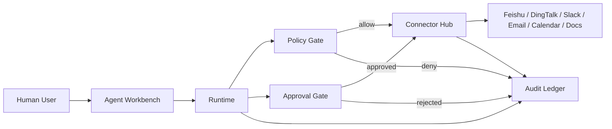

# FlockMesh

Agent-native collaboration framework for the post-chat organization.

FlockMesh is an open framework for teams where humans and agents work together on real business systems.  
The product center is no longer "chat channel". The center is `Agent + Connector + Policy + Audit`.

## One-Line Thesis

FlockMesh is not a new chat tool. It is an organization-grade `Agent Collaboration Operation Layer` with optional office-system connectivity, policy-controlled permissions, and end-to-end auditability.

## Manifesto

- Collaboration should be outcome-first, not message-first.
- Joining a team should include "agent onboarding" as a first-class workflow.
- Integrations should be explicit contracts, not hidden scripts.
- Every agent action should be policy-checked and auditable.
- Open standards should win over platform lock-in.

## Rooted Future Principle

FlockMesh is future-facing, but not ecosystem-breaking.

- Keep using today's office stack (`Feishu`, `DingTalk`, `Slack`, `Email`, `Calendar`, `Jira`, `Notion`).
- Move execution semantics to agent-native runtime.
- Preserve migration path for existing bots, webhooks, and workflows.

## Occam Scope

FlockMesh keeps only six core primitives:

- `Agent` who can act for a role
- `Connector` that can touch a business system
- `Policy` that decides allow/deny/escalate
- `Playbook` that defines repeatable workflows
- `Run` that captures one execution
- `Ledger` that stores immutable audit trail

Everything else is optional UI or ecosystem plugins.

## Non-Negotiable Runtime Invariants

- `Trust Bootstrapping`: no agent execution before user/workspace pairing and allowlist.
- `Workspace Isolation`: agent profile workspace must match run/binding workspace.
- `Fail-Closed`: policy timeout, approval timeout, or connector uncertainty defaults to deny.
- `Policy Precedence`: stricter policy always wins (`org > workspace > agent > run override`).
- `Scoped Capability`: every tool call uses short-lived scoped credentials.
- `Idempotent Side Effects`: mutation actions require idempotency keys and replay guards.
- `Dual-Ledger`: operational events and immutable audit records are stored separately.

## System At A Glance



## Ecosystem Bridge Model

FlockMesh treats current ecosystem tools as execution surfaces, not technical debt.

- Channel surfaces: Feishu group chats, Slack channels, email threads
- System surfaces: calendar, docs, tickets, CRM, internal APIs
- Bridge standards: MCP tools and A2A delegation adapters

Core remains minimal. Adapters can evolve quickly.

## Office Agent Example

This is the default path for a user's office agent:

1. User creates `OfficeAgent` from a role template (`ops`, `sales`, `assistant`, etc.).
2. User selects optional connectors: `Feishu`, `Calendar`, `Email`, `Jira`, `Notion`.
3. System issues scoped capabilities, for example `calendar.read` and `doc.write`.
4. Agent proposes an execution plan before calling tools.
5. Policy engine classifies risk level of each action.
6. High-risk actions require human approval.
7. All requests, approvals, tool calls, and outputs are written to the audit ledger.

This keeps automation useful without turning the system into an ungoverned black box.

## Migration Story (No Big-Bang Rewrite)

1. Connect existing office systems with read-only capabilities first.
2. Add approval-gated write actions for high-value workflows.
3. Port legacy bots and scripts behind connector adapters.
4. Gradually shift from message workflows to playbook workflows.

## Open Source Boundaries (Phase 0)

Included in this repository:

- Agent registry and role template model
- Agent kit catalog + blueprint planner (`preview` and `apply`)
- File-driven agent kit DSL (`kits/*.kit.json`) for community contribution
- Connector SDK with typed contracts
- Policy engine with a minimal policy DSL (`policies/*.policy.json`)
- Execution runtime with approval nodes
- Audit storage schema and replay API

## Policy DSL v0

Policy is file-driven, not hardcoded.  
Each profile is a `*.policy.json` file with `version`, `name`, and `rules`.

Current runtime profiles:

- `policies/org_default_safe.policy.json`
- `policies/workspace_ops_cn.policy.json`
- `policies/agent_ops_assistant.policy.json`

Runtime policy APIs:

- `GET /v0/policy/profiles` for runtime policy inventory and rule summary
- `GET /v0/policy/profiles/{profile_name}/version` for immutable profile hash/version snapshot
- `POST /v0/policy/evaluate` for one action intent
- `POST /v0/policy/patch` for policy profile dry-run/apply patch with simulation preview and audit output
- `GET /v0/policy/patches` for patch/rollback history timeline
- `GET /v0/policy/patches/export` for signed patch history evidence package
- `POST /v0/policy/rollback` for restoring a policy profile from history snapshot (`before|after`)
- `POST /v0/policy/simulate` for batch simulation and decision summary

Patch/rollback apply enforces optimistic profile-hash guard:

- request field (required when `mode=apply`): `expected_profile_hash`
- stale hash response: `409` with `{ expected_profile_hash, current_profile_hash }`

Rollback apply authorization is owner-gated by policy admin config:

- `policies/policy-admins/*.policy-admins.json`
- actor must be in `global_admins` or `profile_admins.<profile_name>`
- dry-run remains available for planning

## Connector Governance v0

Connectors are treated as policy-governed contracts, not opaque scripts.

- Manifests live in `connectors/manifests/*.connector.json`
- Manifests include capability attestation signature and are verified at runtime load
- MCP tool allowlist lives in `policies/mcp-allowlists/*.mcp-allowlist.json`
- Registry endpoint: `GET /v0/connectors/manifests`
- Health summary: `GET /v0/connectors/health`
- Scope drift detector: `GET /v0/connectors/drift`
- MCP allowlist visibility: `GET /v0/connectors/mcp/allowlists`
- Connector rate-limit policy visibility: `GET /v0/connectors/rate-limits`
- Adapter simulation: `POST /v0/connectors/adapters/{connector_id}/simulate`
- Adapter invocation: `POST /v0/connectors/adapters/{connector_id}/invoke`
- Adapter timeout is fail-closed (configurable via `FLOCKMESH_ADAPTER_TIMEOUT_MS`)
- Adapter invoke rate-limit is fail-closed (configurable via `FLOCKMESH_CONNECTOR_RATE_LIMIT_POLICY`)
- Adapter retries are bounded and mutation retries require idempotency key (configurable via `FLOCKMESH_ADAPTER_RETRY_POLICY`)
- Run-level A2A wrappers:
  - `POST /v0/runs/{run_id}/a2a/request`
  - `POST /v0/runs/{run_id}/a2a/{delegation_id}/status`
  - `POST /v0/runs/{run_id}/a2a/{delegation_id}/cancel`

This keeps office-system adapters and agent-protocol adapters under one control surface.

Not in scope yet:

- Full-featured chat product replacement
- Enterprise IAM and billing suite
- Visual no-code builder for every workflow type

## Why Now (Context)

- A2A is now under Linux Foundation governance for open, vendor-neutral agent interoperability (announced June 23, 2025).
- MCP has become a broad ecosystem standard and is governed via AAIF; Anthropic announced donation to AAIF on Dec 9, 2025.
- The MCP specification continues active evolution; current protocol version in spec is `2025-11-25`.
- OpenClaw demonstrates strong demand for local-first agent control planes, plus explicit runtime security defaults.

## OpenClaw Alignment And Extension

What we align with:

- channel and system integration via a gateway model
- strong runtime safety defaults
- human approval for risky actions

What we extend:

- office-first connector taxonomy and capability templates
- policy lattice for multi-level org control
- dual-ledger model for ops telemetry vs immutable audit evidence
- migration path from existing bots/webhooks to typed agent playbooks

## Project Docs

- Vision: `docs/vision.md`
- System Design: `docs/system-design.md`
- Architecture: `docs/architecture.md`
- Roadmap: `docs/roadmap.md`
- Mainline Review: `docs/mainline-review.md`
- MCP Compatibility Notes: `docs/mcp-compatibility.md`
- Compatibility Matrix: `docs/compatibility-matrix.md`
- v0 API Contracts: `spec/README.md`
- Implementation TODO: `TODO.md`

## Run v0 Locally

```bash
npm install
npm run dev
```

Then open:

- Control Plane UI: `http://127.0.0.1:8080/`
- Health: `http://127.0.0.1:8080/health`

Control Plane currently includes:

- One-person Quickstart panel (`workspace + owner + template -> one-click provisioning + first run`)
- Starter mode default layout: `Quickstart + Approval Inbox + Run Feed` with an `Advanced Tools` foldout entry
- Agent Blueprint Studio (`kit -> preview -> lint -> remediation-plan -> apply`)
- Approval Inbox panel (action-level approve/reject)
- Run Timeline Split view (`events` vs `audit`)
- Timeline Diff mode (compare current run against explicit or auto-previous base run in same playbook scope)
- Replay Integrity check (policy-allow replay vs event/audit execution consistency)
- Policy Trace visualizer (per-run decision trace)
- Starter/Advanced mode toggle (default Starter for one-person onboarding, Advanced for governance surfaces)
- Compact Mode toggle (mobile/high-density view)
- Signed incident export API: `GET /v0/runs/{run_id}/incident-export`
- Run timeline diff API: `GET /v0/runs/{run_id}/timeline-diff`
- Run replay integrity API: `GET /v0/runs/{run_id}/replay-integrity`
- Signed replay export API: `GET /v0/runs/{run_id}/replay-export`
- Replay drift monitor API: `GET /v0/monitoring/replay-drift`
- Agent kit catalog API: `GET /v0/templates/agent-kits`
- Agent blueprint preview API: `POST /v0/agent-blueprints/preview`
- Agent blueprint lint API: `POST /v0/agent-blueprints/lint`
- Agent blueprint remediation plan API: `POST /v0/agent-blueprints/remediation-plan`
- Agent blueprint apply API: `POST /v0/agent-blueprints/apply`
- One-person quickstart API: `POST /v0/quickstart/one-person`
- Policy patch console (profile catalog + remediation draft + dry-run/apply + hash guard)
- Policy rollback console (history preview + draft latest + dry-run/apply + hash guard)
- Policy profile version API: `GET /v0/policy/profiles/{profile_name}/version`
- Policy patch API (dry-run/apply): `POST /v0/policy/patch`
- Policy patch history API: `GET /v0/policy/patches`
- Policy patch history export API: `GET /v0/policy/patches/export`
- Policy rollback API (owner-gated apply): `POST /v0/policy/rollback`

Actor identity guardrail:

- Actor-validated mutating APIs require `x-flockmesh-actor-id` and enforce match with body actor claims (`trigger.actor_id`, `approved_by`, `cancelled_by`, `initiated_by`, `owner_id`, `actor_id`).
- Currently enforced on:
  - `POST /v0/quickstart/one-person`
  - `POST /v0/runs`
  - `POST /v0/runs/{run_id}/approvals`
  - `POST /v0/runs/{run_id}/cancel`
  - `POST /v0/connectors/adapters/{connector_id}/simulate`
  - `POST /v0/connectors/adapters/{connector_id}/invoke`
  - `POST /v0/policy/patch`
  - `POST /v0/policy/rollback`
- Control Plane UI now injects this header automatically.

Demo bootstrap in control-plane now defaults to `system-first`:

- connector preset: `con_office_calendar`
- trigger source preset: `system.scheduler:weekly_ops_sync`

Blueprint flow (agent-first onboarding):

```bash
curl -s http://127.0.0.1:8080/v0/templates/agent-kits | jq '.items[].kit_id'

curl -s http://127.0.0.1:8080/v0/agent-blueprints/preview \
  -H 'content-type: application/json' \
  -d '{"workspace_id":"wsp_mindverse_cn","kit_id":"kit_office_ops_core","owners":["usr_yingapple"],"selected_connector_ids":["con_feishu_official","con_mcp_gateway"]}' | jq

curl -s http://127.0.0.1:8080/v0/agent-blueprints/lint \
  -H 'content-type: application/json' \
  -d '{"workspace_id":"wsp_mindverse_cn","kit_id":"kit_office_ops_core","owners":["usr_yingapple"],"selected_connector_ids":["con_feishu_official","con_mcp_gateway"]}' | jq '.summary,.recommendations'

curl -s http://127.0.0.1:8080/v0/agent-blueprints/remediation-plan \
  -H 'content-type: application/json' \
  -d '{"workspace_id":"wsp_mindverse_cn","kit_id":"kit_office_ops_core","owners":["usr_yingapple"],"selected_connector_ids":["con_feishu_official","con_mcp_gateway"]}' | jq '.summary,.connector_actions,.auto_fix_request'

curl -s http://127.0.0.1:8080/v0/agent-blueprints/apply \
  -H 'content-type: application/json' \
  -d '{"workspace_id":"wsp_mindverse_cn","kit_id":"kit_office_ops_core","owners":["usr_yingapple"],"selected_connector_ids":["con_feishu_official","con_mcp_gateway"],"strict_mode":true,"idempotency_key":"idem_blueprint_apply_20260223"}' | jq '.reused,.created_agent.id,.created_bindings[].connector_id'

curl -s http://127.0.0.1:8080/v0/policy/profiles | jq '.total,.items[].profile_name'

curl -s http://127.0.0.1:8080/v0/policy/profiles/workspace_ops_cn/version | jq '.profile_name,.document_hash'

curl -s http://127.0.0.1:8080/v0/policy/patch \
  -H 'content-type: application/json' \
  -H 'x-flockmesh-actor-id: usr_yingapple' \
  -d '{"profile_name":"workspace_ops_cn","mode":"dry_run","actor_id":"usr_yingapple","reason":"preview escalation patch","patch_rules":[{"capability":"ticket.create","decision":"escalate","required_approvals":1}]}' | jq '.mode,.summary,.simulation_preview'

curl -s "http://127.0.0.1:8080/v0/policy/patches?profile_name=workspace_ops_cn&limit=5" | jq '.items[].patch_id'

curl -s "http://127.0.0.1:8080/v0/policy/patches/export?profile_name=workspace_ops_cn&operation=patch&limit=5" | jq '.history.total,.signature.key_id'

curl -s http://127.0.0.1:8080/v0/policy/rollback \
  -H 'content-type: application/json' \
  -H 'x-flockmesh-actor-id: usr_yingapple' \
  -d '{"profile_name":"workspace_ops_cn","mode":"dry_run","target_state":"before","reason":"preview rollback"}' | jq '.mode,.rollback_target_patch_id,.summary'
```

Agent kit DSL files live in `kits/*.kit.json` and are loaded at runtime on startup.

Remediation plan includes `policy_candidates` with `direct/manual/informational` applicability, and `auto_fix_request` now auto-adopts a valid `run_override` candidate when the current override profile is invalid or improveable.

```json
{
  "version": "v0",
  "kit_id": "kit_example",
  "name": "Example Kit",
  "default_playbook_id": "pbk_example_flow",
  "capability_goals": ["message.send"],
  "connector_candidates": [
    {
      "connector_id": "con_feishu_official",
      "required_capabilities": ["message.send"],
      "optional_capabilities": [],
      "risk_profile": "restricted"
    }
  ],
  "rollout": [
    {
      "phase_id": "phase_bootstrap",
      "title": "Bootstrap",
      "focus": "Enable read/send with governance.",
      "approval_expectation": "single"
    }
  ]
}
```

Run tests:

```bash
npm test
```

Benchmark blueprint planner latency:

```bash
npm run bench:blueprint -- --iterations=200 --warmup=30
```

Run protocol bridge smoke check:

```bash
npm run smoke:adapters
```

Run replay drift check (CI/runtime hook):

```bash
npm run replay:drift
```

Check contract/example consistency:

```bash
npm run spec:check
```

When updating `connectors/manifests/*.connector.json`, re-sign attestations:

```bash
npm run manifest:sign
```

To rotate attestation keys in runtime/signing:

```bash
export FLOCKMESH_CONNECTOR_ATTESTATION_KEYS='{"att_dev_main_v1":"your-secret-v1","att_prod_v2":"your-secret-v2"}'
export FLOCKMESH_MANIFEST_SIGN_KEY_ID='att_prod_v2'
export FLOCKMESH_MANIFEST_SIGN_SECRET='your-secret-v2'
export FLOCKMESH_CONNECTOR_RATE_LIMIT_POLICY='{"version":"v0","default":{"limit":30,"window_ms":60000},"connectors":{"con_mcp_gateway":{"limit":12,"window_ms":30000},"con_a2a_gateway":{"limit":20,"window_ms":60000}}}'
export FLOCKMESH_ADAPTER_RETRY_POLICY='{"version":"v0","max_attempts":2,"base_delay_ms":40,"max_delay_ms":320,"jitter_ms":20}'
export FLOCKMESH_INCIDENT_EXPORT_SIGN_KEYS='{"exp_dev_main_v1":"your-incident-export-secret-v1","exp_prod_v2":"your-incident-export-secret-v2"}'
export FLOCKMESH_INCIDENT_EXPORT_SIGN_KEY_ID='exp_prod_v2'
```

## Sources

- https://github.com/openclaw/openclaw
- https://modelcontextprotocol.io/specification/versioning
- https://www.anthropic.com/news/donating-the-model-context-protocol-and-establishing-of-the-agentic-ai-foundation
- https://developers.googleblog.com/en/a2a-a-new-era-of-agent-interoperability/
- https://www.linuxfoundation.org/press/linux-foundation-launches-the-agent2agent-protocol-project-to-enable-secure-intelligent-communication-between-ai-agents

## License

MIT
