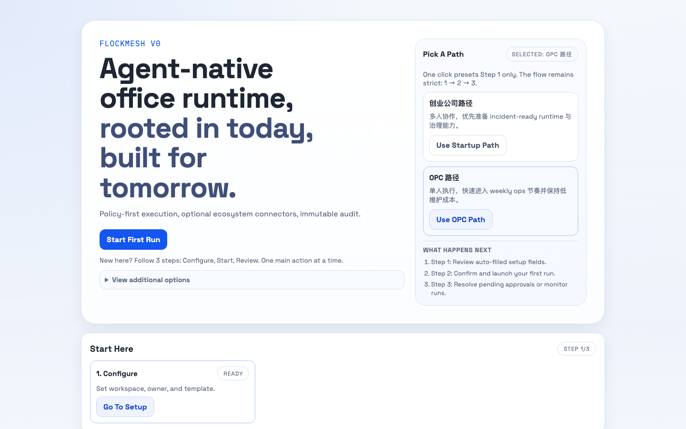
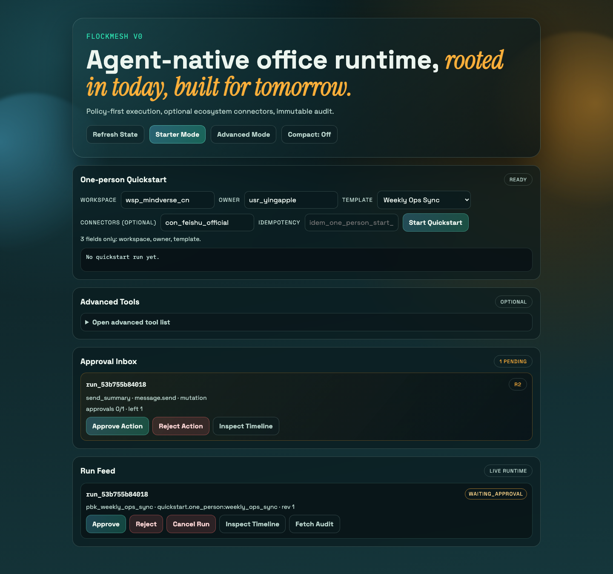
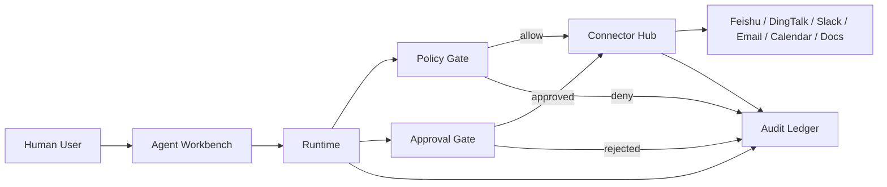

# FlockMesh

Agent-native collaboration framework for the post-chat organization.

## Vision First

FlockMesh is not another chat tool. It is an organization-grade `Agent Collaboration Operation Layer`.

The product center is `Agent + Connector + Policy + Audit`:

- Outcome-first, not message-first.
- Agent onboarding is a first-class workflow.
- Integrations are explicit contracts, not hidden scripts.
- Every action is policy-checked and auditable.
- Open standards win over platform lock-in.

## Desktop UI (Logic in 2 Screens)

FlockMesh desktop control plane is built around one execution loop:

1. Configure: workspace + role-based agent + connectors.
2. Execute: run through policy gate and approval gate.
3. Review: timeline, replay checks, immutable audit evidence.

### 1) Entry View: Setup and Start



### 2) Governance View: Operate and Audit



Refresh screenshots:

```bash
npm run docs:ui-screenshots
```

## Quickstart

```bash
npm install
npm run dev
```

Then open:

- Control Plane UI: `http://127.0.0.1:8080/`
- Health: `http://127.0.0.1:8080/health`

## Project Docs

- Vision: `docs/vision.md`
- System Design: `docs/system-design.md`
- Architecture: `docs/architecture.md`
- Roadmap: `docs/roadmap.md`
- Mainline Review: `docs/mainline-review.md`
- MCP Compatibility Notes: `docs/mcp-compatibility.md`
- Compatibility Matrix: `docs/compatibility-matrix.md`
- Agent IDE Bridge: `docs/agent-ide-bridge.md`
- v0 API Contracts: `spec/README.md`
- Implementation TODO: `TODO.md`

<details>
<summary><strong>System Model and Invariants</strong></summary>

### Why This Repo Is Named `FlockMesh`

- `Flock`: collaboration is many humans and many agents moving together toward one outcome.
- `Mesh`: execution touches many systems, but through one governed network (`connector + policy + approval + audit`).
- The name intentionally avoids chat-first wording. It emphasizes coordinated execution, not message volume.

### Rooted Future Principle

FlockMesh is future-facing, but not ecosystem-breaking.

- Keep using today's office stack (`Feishu`, `DingTalk`, `Slack`, `Email`, `Calendar`, `Jira`, `Notion`).
- Move execution semantics to agent-native runtime.
- Preserve migration path for existing bots, webhooks, and workflows.

### Occam Scope

FlockMesh keeps only six core primitives:

- `Agent` who can act for a role
- `Connector` that can touch a business system
- `Policy` that decides allow/deny/escalate
- `Playbook` that defines repeatable workflows
- `Run` that captures one execution
- `Ledger` that stores immutable audit trail

Everything else is optional UI or ecosystem plugins.

### Non-Negotiable Runtime Invariants

- `Trust Bootstrapping`: no agent execution before user/workspace pairing and allowlist.
- `Workspace Isolation`: agent profile workspace must match run/binding workspace.
- `Fail-Closed`: policy timeout, approval timeout, or connector uncertainty defaults to deny.
- `Policy Precedence`: stricter policy always wins (`org > workspace > agent > run override`).
- `Scoped Capability`: every tool call uses short-lived scoped credentials.
- `Idempotent Side Effects`: mutation actions require idempotency keys and replay guards.
- `Dual-Ledger`: operational events and immutable audit records are stored separately.

### System At A Glance


```mermaid
flowchart LR
    U["Human User"] --> W["Agent Workbench"]
    W --> R["Runtime"]
    R --> P["Policy Gate"]
    P -->|allow| C["Connector Hub"]
    P -->|deny| L["Audit Ledger"]
    C --> F["Feishu / DingTalk / Slack / Email / Calendar / Docs"]
    R --> A["Approval Gate"]
    A -->|approved| C
    A -->|rejected| L
    R --> L
    C --> L
```

### Ecosystem Bridge Model

FlockMesh treats current ecosystem tools as execution surfaces, not technical debt.

- Channel surfaces: Feishu group chats, Slack channels, email threads
- System surfaces: calendar, docs, tickets, CRM, internal APIs
- Bridge standards: MCP tools and A2A delegation adapters

Core remains minimal. Adapters can evolve quickly.

### Office Agent Example

1. User creates `OfficeAgent` from a role template (`ops`, `sales`, `assistant`, etc.).
2. User selects optional connectors: `Feishu`, `Calendar`, `Email`, `Jira`, `Notion`.
3. System issues scoped capabilities, for example `calendar.read` and `doc.write`.
4. Agent proposes an execution plan before calling tools.
5. Policy engine classifies risk level of each action.
6. High-risk actions require human approval.
7. All requests, approvals, tool calls, and outputs are written to the audit ledger.

### Simplicity Promise

- New users keep one default path: `Configure -> Start -> Review`.
- Starter mode exposes one primary action at a time; advanced surfaces stay folded.
- Enterprise guardrails are added at runtime, not as extra first-time setup burden.

### Migration Story (No Big-Bang Rewrite)

1. Connect existing office systems with read-only capabilities first.
2. Add approval-gated write actions for high-value workflows.
3. Port legacy bots and scripts behind connector adapters.
4. Gradually shift from message workflows to playbook workflows.

</details>

<details>
<summary><strong>Open Source Scope (Phase 0)</strong></summary>

Included in this repository:

- Agent registry and role template model
- Agent kit catalog + blueprint planner (`preview` and `apply`)
- File-driven agent kit DSL (`kits/*.kit.json`) for community contribution
- Connector SDK with typed contracts
- Policy engine with a minimal policy DSL (`policies/*.policy.json`)
- Execution runtime with approval nodes
- Audit storage schema and replay API

Not in scope yet:

- Full-featured chat product replacement
- Enterprise IAM and billing suite
- Visual no-code builder for every workflow type

</details>

<details>
<summary><strong>Policy and Connector Governance (v0)</strong></summary>

### Policy DSL v0

Policy is file-driven, not hardcoded. Each profile is a `*.policy.json` file with `version`, `name`, and `rules`.

Current runtime profiles:

- `policies/org_default_safe.policy.json`
- `policies/workspace_ops_cn.policy.json`
- `policies/agent_ops_assistant.policy.json`

Runtime policy APIs:

- `GET /v0/policy/profiles`
- `GET /v0/policy/profiles/{profile_name}/version`
- `POST /v0/policy/evaluate`
- `POST /v0/policy/patch`
- `GET /v0/policy/patches`
- `GET /v0/policy/patches/export`
- `POST /v0/policy/rollback`
- `POST /v0/policy/simulate`

Patch/rollback apply enforces optimistic profile-hash guard:

- request field (required when `mode=apply`): `expected_profile_hash`
- stale hash response: `409` with `{ expected_profile_hash, current_profile_hash }`

Rollback apply authorization is owner-gated by policy admin config:

- `policies/policy-admins/*.policy-admins.json`
- actor must be in `global_admins` or `profile_admins.<profile_name>`
- dry-run remains available for planning

### Connector Governance v0

Connectors are treated as policy-governed contracts, not opaque scripts.

- Manifests: `connectors/manifests/*.connector.json`
- Runtime registry: `GET /v0/connectors/manifests`
- Health summary: `GET /v0/connectors/health`
- Scope drift detector: `GET /v0/connectors/drift`
- MCP allowlist visibility: `GET /v0/connectors/mcp/allowlists`
- Connector rate-limit policy visibility: `GET /v0/connectors/rate-limits`
- Adapter simulation: `POST /v0/connectors/adapters/{connector_id}/simulate`
- Adapter invocation: `POST /v0/connectors/adapters/{connector_id}/invoke`

Fail-closed runtime controls:

- Adapter timeout (`FLOCKMESH_ADAPTER_TIMEOUT_MS`)
- Adapter invoke rate-limit (`FLOCKMESH_CONNECTOR_RATE_LIMIT_POLICY`)
- Bounded retries and idempotency keys for mutation retries (`FLOCKMESH_ADAPTER_RETRY_POLICY`)

Run-level A2A wrappers:

- `POST /v0/runs/{run_id}/a2a/request`
- `POST /v0/runs/{run_id}/a2a/{delegation_id}/status`
- `POST /v0/runs/{run_id}/a2a/{delegation_id}/cancel`

</details>

<details>
<summary><strong>Control Plane Features (Current)</strong></summary>

- One-person Quickstart panel (`workspace + owner + template -> one-click provisioning + first run`)
- Starter mode default layout: `Quickstart + Approval Inbox + Run Feed` with `Advanced Tools` foldout
- Agent Blueprint Studio (`kit -> preview -> lint -> remediation-plan -> apply`)
- Approval Inbox panel (action-level approve/reject)
- Run Timeline Split view (`events` vs `audit`)
- Timeline Diff mode (explicit or auto previous run in same playbook scope)
- Replay Integrity check (policy-allow replay vs event/audit consistency)
- Policy Trace visualizer (per-run decision trace)
- Starter/Advanced mode toggle
- Compact Mode toggle
- Signed incident export API: `GET /v0/runs/{run_id}/incident-export`
- Run timeline diff API: `GET /v0/runs/{run_id}/timeline-diff`
- Run replay integrity API: `GET /v0/runs/{run_id}/replay-integrity`
- Signed replay export API: `GET /v0/runs/{run_id}/replay-export`
- Replay drift monitor API: `GET /v0/monitoring/replay-drift`
- Agent kit catalog API: `GET /v0/templates/agent-kits`
- Agent blueprint preview API: `POST /v0/agent-blueprints/preview`
- Agent blueprint lint API: `POST /v0/agent-blueprints/lint`
- Agent blueprint remediation plan API: `POST /v0/agent-blueprints/remediation-plan`
- Agent blueprint apply API: `POST /v0/agent-blueprints/apply`
- One-person quickstart API: `POST /v0/quickstart/one-person`
- Agent IDE bridge profile API: `GET /v0/integrations/agent-ide-profile`
- Agent IDE streamable HTTP bridge APIs: `GET /v0/mcp/stream`, `POST /v0/mcp/stream`
- Policy patch console (`catalog + remediation draft + dry-run/apply + hash guard`)
- Policy rollback console (`history preview + draft latest + dry-run/apply + hash guard`)

Actor identity guardrail:

- Mutating APIs require `x-flockmesh-actor-id` and enforce actor match with body claims (`trigger.actor_id`, `approved_by`, `cancelled_by`, `initiated_by`, `owner_id`, `actor_id`).
- Enforced on:
  - `POST /v0/quickstart/one-person`
  - `POST /v0/runs`
  - `POST /v0/runs/{run_id}/approvals`
  - `POST /v0/runs/{run_id}/cancel`
  - `POST /v0/connectors/adapters/{connector_id}/simulate`
  - `POST /v0/connectors/adapters/{connector_id}/invoke`
  - `POST /v0/policy/patch`
  - `POST /v0/policy/rollback`
- Control Plane UI injects this header automatically.

</details>

<details>
<summary><strong>Advanced Usage and Commands</strong></summary>

### Blueprint flow (agent-first onboarding)

```bash
curl -s http://127.0.0.1:8080/v0/templates/agent-kits | jq '.items[].kit_id'

curl -s http://127.0.0.1:8080/v0/agent-blueprints/preview \
  -H 'content-type: application/json' \
  -d '{"workspace_id":"wsp_mindverse_cn","kit_id":"kit_office_ops_core","owners":["usr_yingapple"],"selected_connector_ids":["con_feishu_official","con_mcp_gateway"]}' | jq

curl -s http://127.0.0.1:8080/v0/agent-blueprints/lint \
  -H 'content-type: application/json' \
  -d '{"workspace_id":"wsp_mindverse_cn","kit_id":"kit_office_ops_core","owners":["usr_yingapple"],"selected_connector_ids":["con_feishu_official","con_mcp_gateway"]}' | jq '.summary,.recommendations'

curl -s http://127.0.0.1:8080/v0/agent-blueprints/remediation-plan \
  -H 'content-type: application/json' \
  -d '{"workspace_id":"wsp_mindverse_cn","kit_id":"kit_office_ops_core","owners":["usr_yingapple"],"selected_connector_ids":["con_feishu_official","con_mcp_gateway"]}' | jq '.summary,.connector_actions,.auto_fix_request'

curl -s http://127.0.0.1:8080/v0/agent-blueprints/apply \
  -H 'content-type: application/json' \
  -d '{"workspace_id":"wsp_mindverse_cn","kit_id":"kit_office_ops_core","owners":["usr_yingapple"],"selected_connector_ids":["con_feishu_official","con_mcp_gateway"],"strict_mode":true,"idempotency_key":"idem_blueprint_apply_20260223"}' | jq '.reused,.created_agent.id,.created_bindings[].connector_id'
```

### Policy patch and rollback flow

```bash
curl -s http://127.0.0.1:8080/v0/policy/profiles | jq '.total,.items[].profile_name'

curl -s http://127.0.0.1:8080/v0/policy/profiles/workspace_ops_cn/version | jq '.profile_name,.document_hash'

curl -s http://127.0.0.1:8080/v0/policy/patch \
  -H 'content-type: application/json' \
  -H 'x-flockmesh-actor-id: usr_yingapple' \
  -d '{"profile_name":"workspace_ops_cn","mode":"dry_run","actor_id":"usr_yingapple","reason":"preview escalation patch","patch_rules":[{"capability":"ticket.create","decision":"escalate","required_approvals":1}]}' | jq '.mode,.summary,.simulation_preview'

curl -s "http://127.0.0.1:8080/v0/policy/patches?profile_name=workspace_ops_cn&limit=5" | jq '.items[].patch_id'

curl -s "http://127.0.0.1:8080/v0/policy/patches/export?profile_name=workspace_ops_cn&operation=patch&limit=5" | jq '.history.total,.signature.key_id'

curl -s http://127.0.0.1:8080/v0/policy/rollback \
  -H 'content-type: application/json' \
  -H 'x-flockmesh-actor-id: usr_yingapple' \
  -d '{"profile_name":"workspace_ops_cn","mode":"dry_run","target_state":"before","reason":"preview rollback"}' | jq '.mode,.rollback_target_patch_id,.summary'
```

### Agent kit DSL sample

```json
{
  "version": "v0",
  "kit_id": "kit_example",
  "name": "Example Kit",
  "default_playbook_id": "pbk_example_flow",
  "capability_goals": ["message.send"],
  "connector_candidates": [
    {
      "connector_id": "con_feishu_official",
      "required_capabilities": ["message.send"],
      "optional_capabilities": [],
      "risk_profile": "restricted"
    }
  ],
  "rollout": [
    {
      "phase_id": "phase_bootstrap",
      "title": "Bootstrap",
      "focus": "Enable read/send with governance.",
      "approval_expectation": "single"
    }
  ]
}
```

### Codex and Claude Code bridge

```bash
# 1) Generate one IDE bridge profile
curl -s "http://127.0.0.1:8080/v0/integrations/agent-ide-profile?workspace_id=wsp_mindverse_cn&actor_id=usr_yingapple" | jq

# 2) Launch MCP stdio bridge directly
FLOCKMESH_ROOT_DIR="$(pwd)" \
FLOCKMESH_WORKSPACE_ID="wsp_mindverse_cn" \
FLOCKMESH_ACTOR_ID="usr_yingapple" \
npm run mcp:bridge

# 3) Or call MCP over HTTP JSON-RPC
curl -i -s http://127.0.0.1:8080/v0/mcp/stream \
  -H 'content-type: application/json' \
  -d '{"jsonrpc":"2.0","id":"init-1","method":"initialize","params":{"capabilities":{},"clientInfo":{"name":"codex","version":"1.0.0"}}}'
```

Optional advanced controls:

- `FLOCKMESH_MCP_BRIDGE_BEARER_TOKEN` to require `Authorization: Bearer <token>` on `/v0/mcp/stream`
- `mcp-protocol-version` request header to pin protocol revision explicitly

Bridge toolset:

- `flockmesh_quickstart_one_person`
- `flockmesh_invoke_mcp_tool`
- `flockmesh_list_pending_approvals`
- `flockmesh_resolve_approval`
- `flockmesh_get_run_audit`

### Test, benchmark, and ops commands

```bash
npm test
npm run bench:blueprint -- --iterations=200 --warmup=30
npm run smoke:adapters
npm run replay:drift
npm run spec:check
npm run manifest:sign
```

To rotate attestation keys:

```bash
export FLOCKMESH_CONNECTOR_ATTESTATION_KEYS='{"att_dev_main_v1":"your-secret-v1","att_prod_v2":"your-secret-v2"}'
export FLOCKMESH_MANIFEST_SIGN_KEY_ID='att_prod_v2'
export FLOCKMESH_MANIFEST_SIGN_SECRET='your-secret-v2'
export FLOCKMESH_CONNECTOR_RATE_LIMIT_POLICY='{"version":"v0","default":{"limit":30,"window_ms":60000},"connectors":{"con_mcp_gateway":{"limit":12,"window_ms":30000},"con_a2a_gateway":{"limit":20,"window_ms":60000}}}'
export FLOCKMESH_ADAPTER_RETRY_POLICY='{"version":"v0","max_attempts":2,"base_delay_ms":40,"max_delay_ms":320,"jitter_ms":20}'
export FLOCKMESH_INCIDENT_EXPORT_SIGN_KEYS='{"exp_dev_main_v1":"your-incident-export-secret-v1","exp_prod_v2":"your-incident-export-secret-v2"}'
export FLOCKMESH_INCIDENT_EXPORT_SIGN_KEY_ID='exp_prod_v2'
```

</details>

<details>
<summary><strong>Context and Sources</strong></summary>

### Why now

- A2A is under Linux Foundation governance for open, vendor-neutral agent interoperability (announced June 23, 2025).
- MCP has become a broad ecosystem standard and is governed via AAIF; Anthropic announced donation to AAIF on December 9, 2025.
- MCP specification is actively evolving; current protocol version in spec is `2025-11-25`.
- OpenClaw demonstrates strong demand for local-first agent control planes and explicit runtime security defaults.

### OpenClaw alignment and extension

What we align with:

- channel and system integration via a gateway model
- strong runtime safety defaults
- human approval for risky actions

What we extend:

- office-first connector taxonomy and capability templates
- policy lattice for multi-level org control
- dual-ledger model for ops telemetry vs immutable audit evidence
- migration path from existing bots/webhooks to typed agent playbooks

Sources:

- https://github.com/openclaw/openclaw
- https://modelcontextprotocol.io/specification/versioning
- https://www.anthropic.com/news/donating-the-model-context-protocol-and-establishing-of-the-agentic-ai-foundation
- https://developers.googleblog.com/en/a2a-a-new-era-of-agent-interoperability/
- https://www.linuxfoundation.org/press/linux-foundation-launches-the-agent2agent-protocol-project-to-enable-secure-intelligent-communication-between-ai-agents

</details>

## License

MIT
